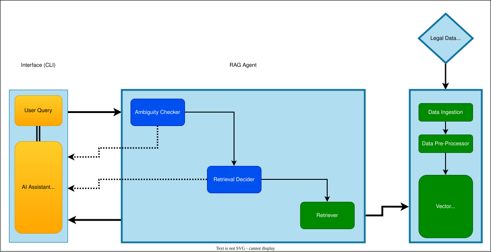

# LegalAI - Legal AI Research Assistant (v0.1)

## About:

Usually legal professionals are not highly technically equipped to right and verify detailed prompts and its response. LegalAI solves this by using Agentic RAG system that provides solution only from a real source along with citations.

Also, it helps them to perform various activities of their day to day tasks at a lightening fast speed with reduced hallucinations and more confidence.
For example, legal research, creation of legal documents, etc

Following features are in the roadmap of this project:

  1. Web crawler or a data scrappper to gather realtime updates from Indian legal websites.
  2. User Interface like a chat system
  3. Evaluation metrics
  4. Deployment on cloud
  5. Improvements:
    - Multi-chat threads
    - Memory enhancements and streaming capabilities

## Key Characteristics:

- End-to-end document ingestion pipeline, including document parsing, text chunking (via Docling), and noise filtering for cleaner embeddings.
- Generated semantic embeddings and indexed in ChromaDB to enable precise similarity search and contextual retrieval.
- Agent-oriented query handling, separating clarification, retrieval, and response generation responsibilities.
- FastAPI-based APIs for document upload, data ingestion, and chat-style query interactions on CLI.
- Step-level logging and traceability to observe agent behavior, intermediate states, and retrieval outputs for debugging and iteration.
- Structured the system for future extensibility, supporting new agents, evolving prompts, and additional data sources.

## Architecture

## Tech stack
- Python
- LangGraph
- Langchain
- OpenAI
- Chroma DB
- Docling

## How to run
1. Clone the repo
2. create an .env file with API key for the LLM
3. Install dependencies
4. Run main entry file from root with this command: python -m app.main

## Folder structure (high level)
  '''
  .
  ├── app
  │   └── main.py
  ├── chromadb_persis\n
  ├── project_data
  ├── scripts
  ├── src
  │   ├── agents
  │   ├── data_indexing
  │   ├── data_preprocessing
  │   ├── embeddings
  │   ├── llm_chain
  │   ├── prompt_templates
  │   ├── retrieval
  │   ├── schema
  │   └── utilities
  '''
